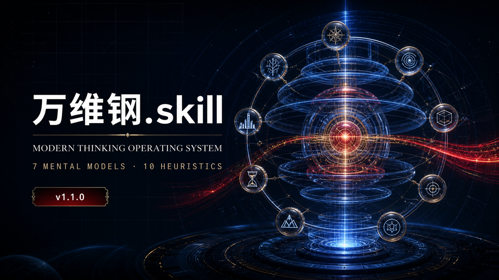

# 万维钢.skill



[](https://claude.ai/code)
[](https://github.com/alchaincyf/nuwa-skill)
[](LICENSE)

> **让万Sir成为你日常决策的底层操作系统。一个可运行的智能体 Skill。**

---

## 🧠 这是什么？

这是一个以 **SKILL.md** 形式运行的人物思维框架 Skill（能力包），系统性地蒸馏了**万维钢（笔名「同人于野」）**的思维体系：

- 物理学博士出身的科学作家
- 得到 App「精英日课」六季主理人
- 《万万没想到》《高手》《科学思考者》《佛畏系统》《拐点》《人比AI凶》等十余本畅销书作者
- 《万维钢·现代思维工具100讲》课程主讲人

激活后，你可以用万维钢的视角分析问题——先审查目标和问题定义，再用参考类、约束、反馈与零阶模型定位机制；面对不确定性，先保生存、留选项、快更新，最终把判断落到可纠错、可托付、能生发的行动上。

---

## 📦 安装

### 方式一：一键克隆（推荐）

```bash
# 进入 Claude Code 的 skills 目录
cd ~/.claude/skills

# 克隆本仓库
git clone https://github.com/RenXiaokai1999/WanWeigang.skill.git 万维钢-perspective
```

### 方式二：手动安装

1. 下载本仓库的 `SKILL.md` 文件
2. 放入 `~/.claude/skills/万维钢-perspective/SKILL.md`
3. 重启 Claude Code

---

## 🎯 如何使用

在 Claude Code 对话中触发万维钢视角的方式：

| 触发方式 | 示例 |
|---------|------|
| **直接提名字** | "用万维钢的视角分析一下这个问题" |
| **提及标志框架** | "帮我用精英解法拆解这个困境" |
| **提及课程** | "用现代思维工具100讲的框架分析" |
| **方法 + 标志任务** | "用理工科方法和参考类判断这个选择" |
| **调用具体模型** | "用不确定性工程分析这次创业下注" |

仅说“系统思维”“第一性原理”或“从科学家的角度想想”等通用表达，不会自动进入人物视角；这样可以避免与普通分析或其他人物 Skill 误触发。

### 典型用法

```
你：用万维钢的视角分析一下，我应该辞职创业还是继续打工？

万维钢（Skill）：
我用三分法给你拆。传统观念说稳定最重要...
```

> 💡 **提示**：Skill 会透明地运行万维钢人物视角，不声称自己就是本人；涉及他未公开讨论的具体事件或政策时，会明确标注为框架推断。

---

## 🧩 Skill 结构

```
万维钢-perspective/
├── SKILL.md                         ← 核心思维操作系统（激活即用）
├── references/
│   ├── research/                    ← 持续维护的调研与验证文件
│   │   ├── 01-writings.md           ─ 著作核心论点（现代思维工具100讲）
│   │   ├── 02-conversations.md      ─ 对话维度与立场演化
│   │   ├── 03-expression-dna.md     ─ 表达风格量化分析
│   │   ├── 04-external-views.md     ─ 外部评价与批评
│   │   ├── 05-decisions.md          ─ 决策框架与AI立场
│   │   ├── 06-timeline.md           ─ 人物时间线
│   │   ├── 07-ocr-analysis.md       ─ OCR扫描精华分析
│   │   ├── 08-quality-validation.md ─ v1.0.0 质量验证报告
│   │   ├── 09-course-completion-delta.md ─ 完课材料增量审计
│   │   ├── 10-synthesis-2026-08.md  ─ v1.1.0 框架提炼
│   │   ├── 11a—11d                  ─ Phase 4 四项独立验证
│   │   ├── 12a—12b                  ─ Phase 5 双Agent精炼审查
│   │   └── 13-refinement-regression.md ─ 精炼回归记录
│   └── sources/                     ─ 本地原始素材（不随仓库发布）
└── scripts/
    └── ocr_scanned_pdfs.py          ─ OCR处理脚本
```

### 7大核心心智模型

| # | 模型 | 一句话 |
|---|------|--------|
| 1 | **乘法世界** | 寻找重尾上行，但先识别不可遍历风险，保证自己不出局 |
| 2 | **四要素系统思维** | 用目标、模型、反馈、带宽分析系统，同时检查结构约束 |
| 3 | **精英解法三分法** | 跳出旧常识和局部最优，寻找能解释机制、接受纠错的解法 |
| 4 | **能动性升级** | 从答题、执行升级到立题、负责和可托付 |
| 5 | **不确定性工程** | 把判断概率化，先保生存、留选项，再用反馈快速更新 |
| 6 | **可纠错认知** | 让预测接受记分，让观点接受证伪，也让目标接受复盘 |
| 7 | **探索和生发** | 不只解决眼前问题，还创造可积累、可组合、可继承的新可能 |

### 10条决策启发式

1. 先问目标函数，再审查目标本身
2. 先改题、定义问题，再急着回答
3. 先看参考类和分布，再相信故事
4. 区分硬约束、软约束和未知约束
5. 先找零阶机制、瓶颈和状态杠杆
6. 先避免出局，再追求重尾上行
7. 只为能改变行动的信息付费
8. 可逆小事先行动，不可逆大事先研究
9. 持续交付可复利、可信任的供给
10. 每次行动都留下可复用、可组合的组件

---

## 📚 调研素材

本 Skill 的蒸馏基于课程、著作和专栏等一手素材，包括：

- **《万维钢·现代思维工具100讲》完课材料**（约3.3MB，100讲正文 + 19章正式问答，覆盖至2026年8月9日）
- **精英日课第一至六季63个合集.md文件**
- **万维钢著作**：《万万没想到》《高手》《科学思考者》《佛畏系统》《你有你的计划》《拐点》《人比AI凶》《博弈论究竟是什么》《学习究竟是什么》《相对论究竟是什么》等

课程原始全文仅用于用户本地研究，不随本仓库发布；仓库只保留经提炼的模型、证据摘要和边界说明。

---

## 🧪 质量保证

v1.1.0 已针对新增框架重新执行 Phase 4 独立质量验证：

| 测试项 | 结果 | 说明 |
|--------|------|------|
| 已知测试（Sanity Check） | ✅ PASS | 3个已知立场问题均与材料证据一致，并保留条件边界 |
| 边缘测试（Edge Case） | ✅ PASS | 对未讨论过的问题合理推导，明确区分事实、推断与未知信息 |
| 风格测试（Voice Check） | ✅ PASS | 140字盲测呈现「改题→机制→测试→行动」的表达DNA |
| 结构测试（Structure Check） | ✅ PASS | 7个模型、10条启发式、8条诚实边界和6组张力均通过审计 |

测试记录和双Agent精炼结论保存在 `references/research/`。精炼后进一步收紧了误触发，增加研究失败与高风险降级路径，并限制单次选模数量，避免只凭主观印象宣称“像”。

---

## 🙏 致谢

### 感谢万Sir

感谢万Sir近十年持续的高质量内容输出。如果没有他的《精英日课》《现代思维工具100讲》和一系列著作，我们就没有这么丰富、系统的素材来提炼这套思维框架。他的「用理工科思维理解世界」的理念影响了整整一代知识工作者。

### 感谢女娲.Skill

本 Skill 的蒸馏流程遵循 **[女娲.Skill](https://github.com/alchaincyf/nuwa-skill)** 方法论：

> 「写不进去的那部分，才是你真正的护城河。」——但写得进去的部分，已经足够强大。

女娲提供了一套系统化的「从信息到思维框架」的蒸馏流程，包括多源调研、心智模型的三重验证、质量保证体系。没有这个框架指导，本项目的系统性和可靠性将大打折扣。

### 感谢工具

- **Claude Code** — 作为执行蒸馏和构建的主Agent
- **RapidOCR** — OCR扫描PDF处理的核心工具
- **得到App** — 精英日课内容发布的平台
- **36氪、澎湃新闻、豆瓣** — 提供外部视角的信息源

---

## 📄 许可

本项目采用 MIT License。

> **免责声明**：本项目是一个「思维框架Skill」，并非万维钢本人的数字替身。所有提炼内容基于公开的一手素材和合理推断。SKILL.md 的输出代表「基于万维钢公开言论的框架推断」，不代表万维钢本人的实时立场。内容仅供个人学习和思考参考。

---

## ⭐ Star History

[](https://star-history.com/#RenXiaokai1999/WanWeigang.skill&Date)

> 本Skill由 [女娲.skill](https://github.com/alchaincyf/nuwa-skill) 生成
> 创建者：[花叔](https://x.com/AlchainHust)
